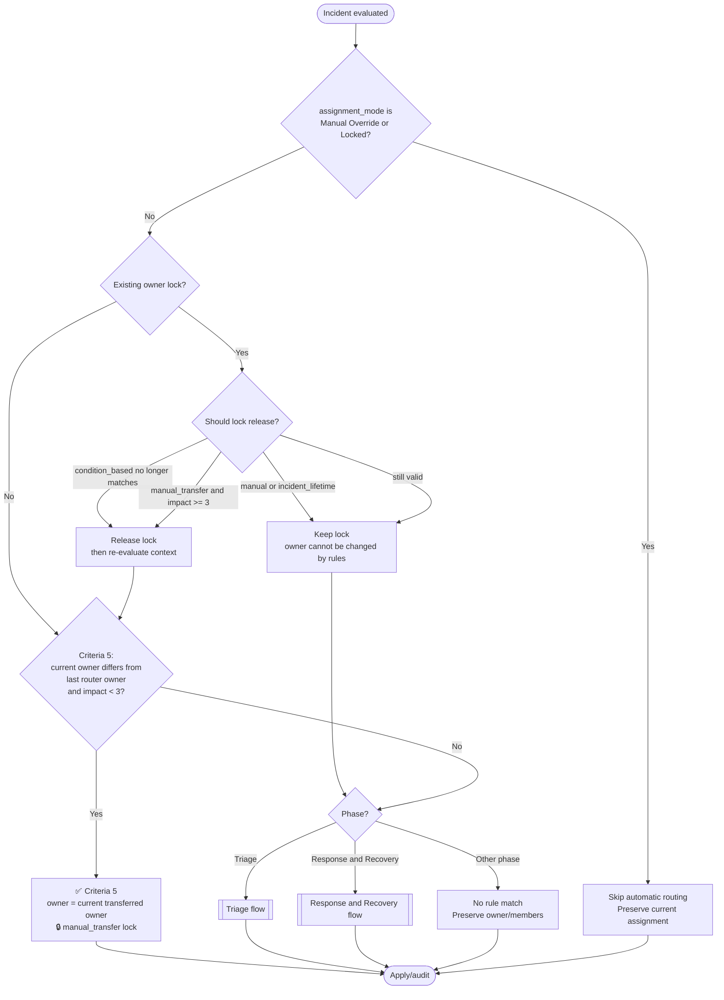
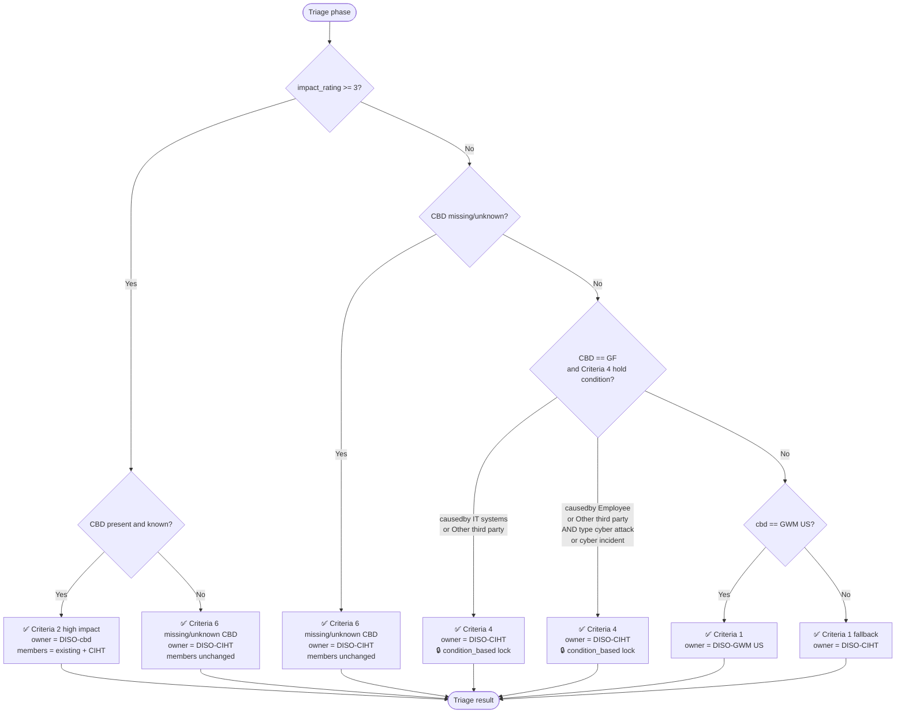
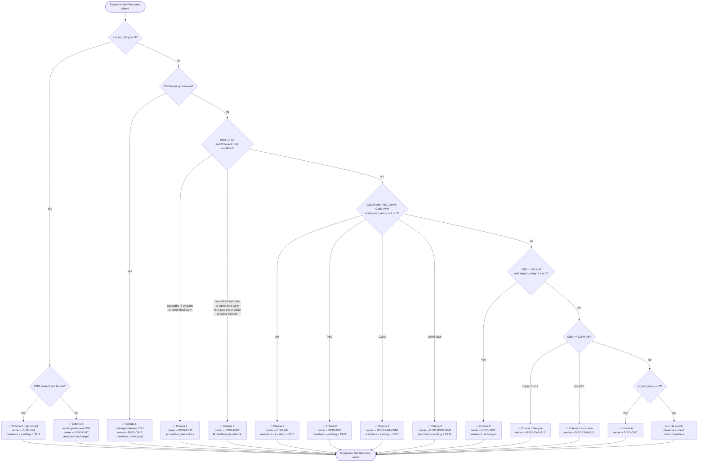
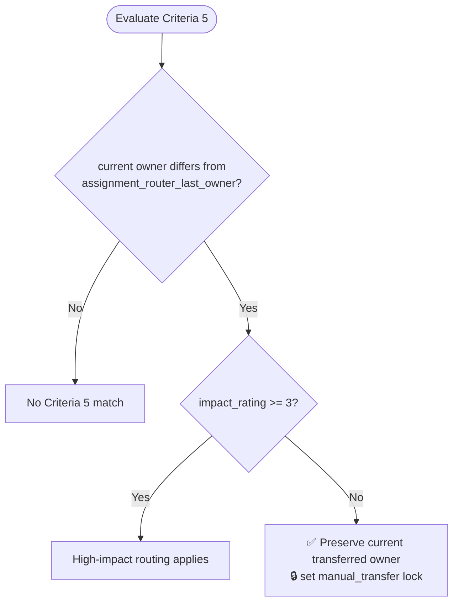

# Assignment Ruleset Logical Flow

This document describes the current deterministic flow implemented in `assignment_ruleset.py` from the present `requirements.txt` criteria.

Legend:

- ✅ = explicit rule path represented in the ruleset
- 🔒 = owner lock behavior
- “No rule match” = script preserves current owner/members and writes skip/no-match audit

## Priority order

The router evaluates matching rules by descending priority. Higher-priority scalar assignments, such as owner, win.

| Priority | Rule |
|---:|---|
| 1000 | Criteria 5 - Preserve manual transfer |
| 900 | Criteria 2 - High impact routes to `DISO-{cbd}`, Triage or Response and Recovery |
| 880 | Criteria 6 - Missing CBD routes to `DISO-CIHT`, Triage or Response and Recovery |
| 800 | Criteria 4 - GF causedby CIHT hold |
| 790 | Criteria 4 - GF causedby/type CIHT hold |
| 720 | Criteria 1 - Response and Recovery GWM US lifecycle owner |
| 700 | Criteria 2 - Response and Recovery AM/P&C/GWM/GWM WMI low-medium impact business owner |
| 650 | Criteria 2 - Response and Recovery GF/IB impact 1-2 stays with CIHT |
| 620 | Criteria 6 - Response and Recovery impact 0 GWM US owner |
| 600 | Criteria 6 - Response and Recovery impact 0 default CIHT owner |
| 500 | Criteria 1 - Triage GWM US owner |
| 100 | Criteria 1 - Triage default CIHT owner |

## Overall flow

## Triage flow

## Response and Recovery flow

## Criteria 5 manual transfer protection

Criteria 5 is generic for transfers from any owner `X` to any owner `Y`. Protected manual transfers created through `manual_transfer.py` write the same `manual_transfer` lock directly.

## Lock behavior

- `manual_transfer` locks preserve the transferred owner while impact is below `3`; they release when impact becomes `3` or higher so high-impact routing can apply.
- `condition_based` locks created by Criteria 4 remain only while their creating Criteria 4 rule still matches.
- `manual` and `incident_lifetime` locks protect the owner until explicitly cleared by an authorized user/admin process.
