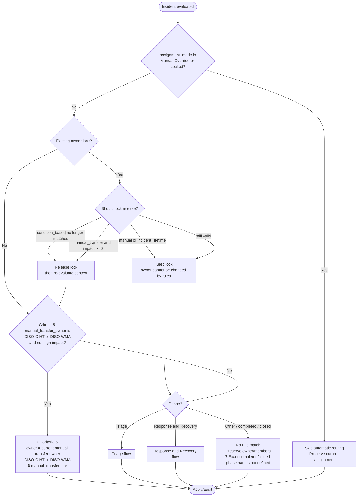
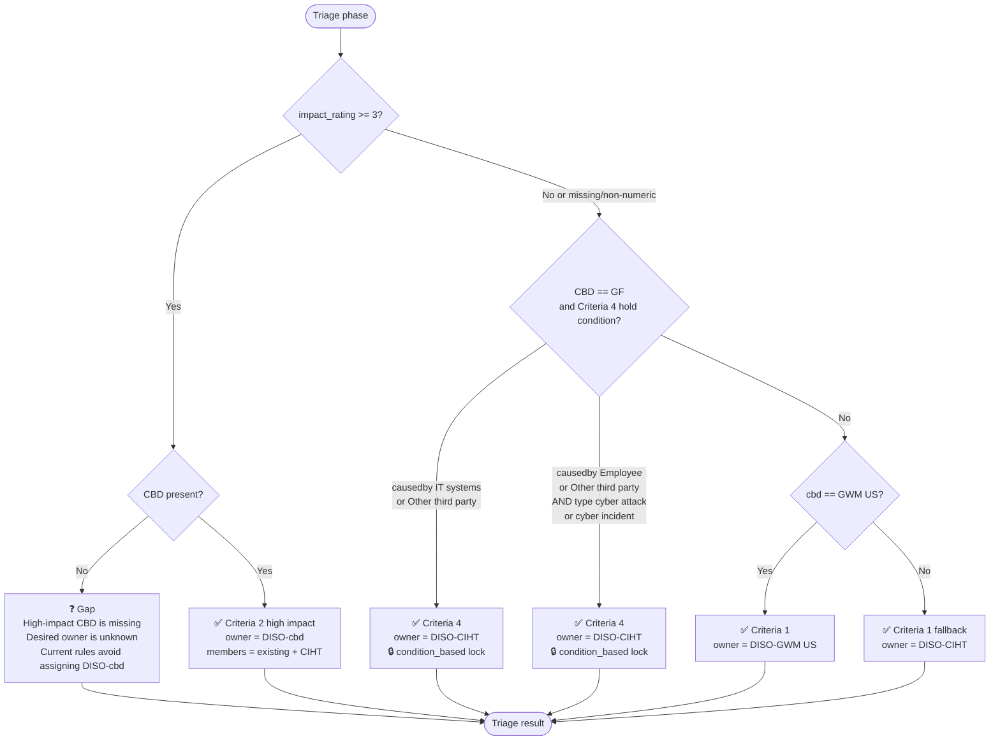
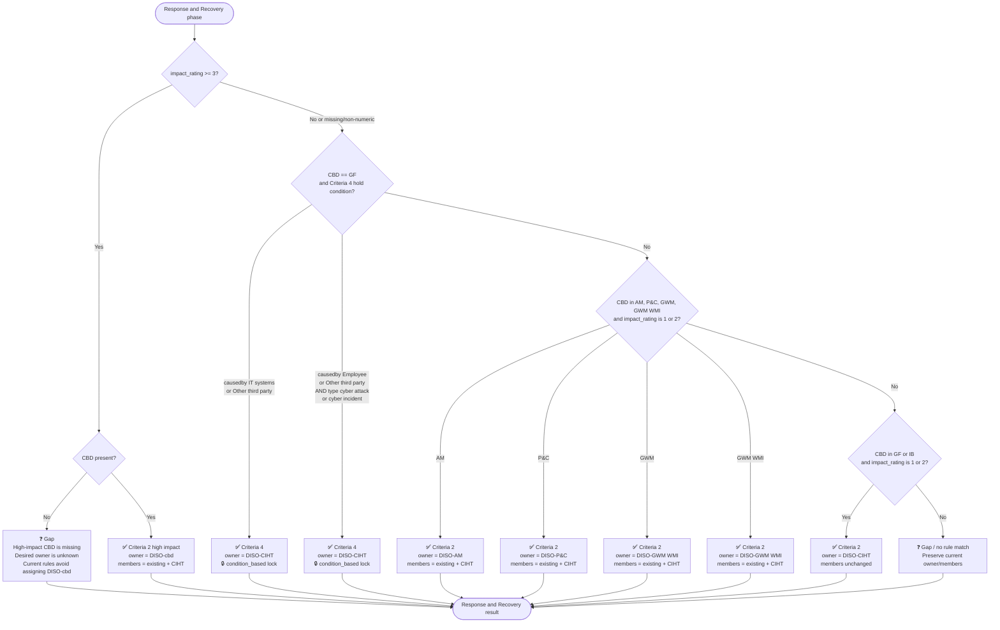
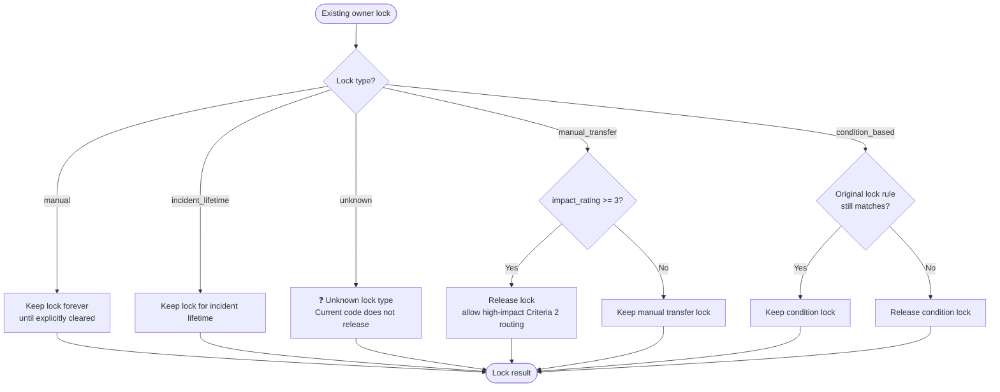
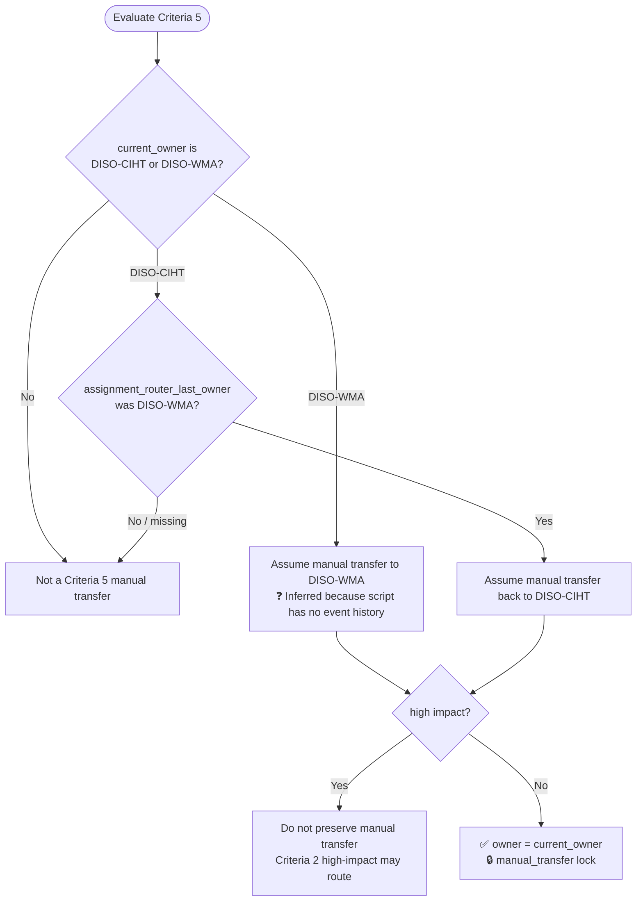

# Assignment Ruleset Logical Flow

This document visualizes the deterministic flow implemented in `assignment_ruleset.py` after the latest `requirements.txt` updates. Paths that are not explicitly defined by the written criteria are marked with **❓ gap**.

Legend:

- ✅ = explicit rule path
- 🔒 = owner lock behavior
- ❓ = behavior is not explicitly defined/needs clarification
- “No rule match” = script preserves current owner/members and writes skip/no-match audit

> User note applied: when CBD is missing, the flow leaves that path as a **❓** because the desired behavior is unknown.

## Priority order

The router evaluates all matching rules and applies scalar fields, like owner, from the highest-priority matching rule first.

| Priority | Rule |
|---:|---|
| 1000 | Criteria 5 - Preserve manual CIHT/WMA transfer |
| 900 | Criteria 2 - High impact routes to `DISO-{cbd}`, Triage or Response and Recovery |
| 800 | Criteria 4 - GF causedby CIHT hold |
| 790 | Criteria 4 - GF causedby/type CIHT hold |
| 700 | Criteria 2 - Response and Recovery AM/P&C/GWM low-medium impact business owner |
| 650 | Criteria 2 - Response and Recovery GF/IB impact 1-2 stays with CIHT |
| 500 | Criteria 1 - Triage GWM US owner |
| 100 | Criteria 1 - Triage default CIHT owner |

## Overall flow

## Triage flow

### Triage gap notes

- ❓ High-impact Triage with missing `cbd` is intentionally left undefined in the flow. The ruleset does not apply the `DISO-{cbd}` high-impact owner formula when CBD is missing.
- ❓ Non-numeric or missing `impact_rating` is treated as not high impact; if this should be invalid or separately routed, that needs clarification.
- ❓ Accepted values and case sensitivity for `cbd`, `causedby`, and `type` are not defined. Current code uses exact string matching.

## Response and Recovery flow

### Response and Recovery gap notes

The following Response and Recovery paths have no explicit assignment rule and therefore preserve current assignment:

- ❓ `cbd` is missing, including when impact is high. Desired behavior is unknown.
- ❓ `cbd` is `AM`, `P&C`, `GWM`, or `GWM WMI` but `impact_rating` is missing, non-numeric, `0`, or below `1`.
- ❓ `cbd` is `GF` or `IB` but `impact_rating` is missing, non-numeric, `0`, or below `1`.
- ❓ `cbd` is `GWM US`, `WMA`, or any other non-listed value with impact below `3`.
- ❓ Whether the CBD value should be `GWM`, `GWM WMI`, or both in Response and Recovery was not fully explicit; current rules support both for low-medium impact routing to `DISO-GWM WMI`.
- ❓ Accepted values and case sensitivity for `cbd`, `causedby`, and `type` are not defined. Current code uses exact string matching.

## Owner lock flow

## Criteria 5 manual transfer detection

### Criteria 5 gap notes

- ❓ The script cannot see true previous-owner event history; it infers manual transfer from current owner plus `assignment_router_last_owner`.
- ❓ The requirements say “rest of the case lifecycle,” but also high-impact escalation rules exist. Current implementation lets high impact override the manual-transfer lock.
- ❓ The criteria use `CIHT` in this section, while other criteria use `DISO-CIHT`. Current rules consistently use owner `DISO-CIHT`.

## Consolidated unresolved clarification list

1. ❓ What should happen when `cbd` is missing? This is intentionally shown as unknown in the diagrams.
2. ❓ What should happen when `impact_rating` is missing, zero, below one, or non-numeric?
3. ❓ What should happen in Response and Recovery for CBD values outside `AM`, `P&C`, `GWM`, `GWM WMI`, `GF`, and `IB` when impact is below `3`?
4. ❓ Should high-impact unknown but non-missing CBD values always use `DISO-{cbd}`?
5. ❓ Should Criteria 5 manual transfer protection override high-impact escalation, or should high impact override manual transfer?
6. ❓ What are the exact closed/completed phase names, and should they be explicit no-op rules?
7. ❓ Are field values case-sensitive exactly as shown, or should the router normalize values like `gf`, `GF`, `Gf`?
